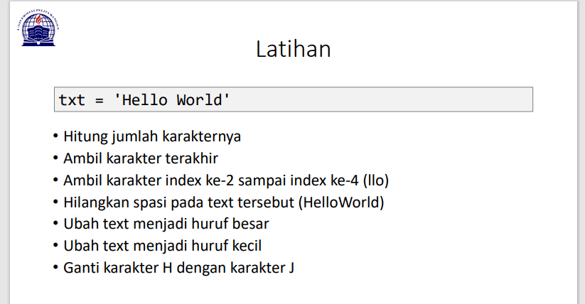
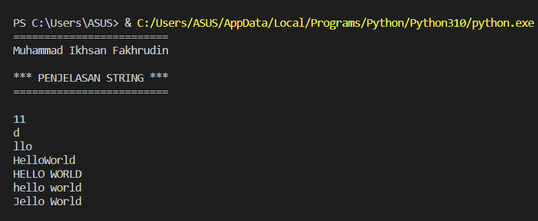
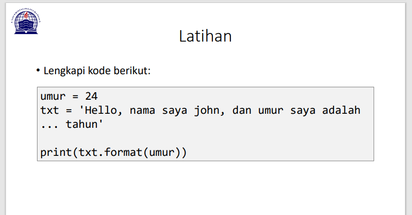
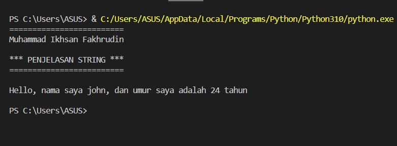

# Tugas Praktikum {Pertemuan ke 14}  

|**Nama**|**NIM**|**Kelas**|**Matkul**|
|----|---|-----|------|
|Muhammad Ikhsan Fakhrudin|312210019|TI.22.A2|Pemrograman|

# Python String

- String adalah jenis yang paling populer di Python.
- Untuk membuatnya hanya dengan melampirkan karakter dalam tanda kutip.
- Python memperlakukan tanda kutip tunggal (' ') sama dengan tanda kutip ganda (" ").
- Membuat string semudah memberi nilai pada sebuah variabel.

# Latihan 1



**Penjelasan Latihan 1**

- Untuk menghitung jumlah karakter, gunakan fungsi `len()`.
```
Menghitung jumlah karakternya
print(len(txt))
```
- Cara mengambil satu karakter pada string yaitu dengan menggunakan kurung siku [ ] dan deklarasi nomor di dalam kurung siku dengan urutan ARRAY dan menggunakan titik dua lalu masukan nomor ARRAY selanjutnya. Untuk mengambil karakter terakhir, gunakan index [-1]. Sedangkan untuk mengambil karakter index ke-2 sampai ke-4, gunakan index [2:5].
```
Mengambil karakter terakhir
print(txt[-1])
Mengambil karakter index ke-2 sampai index ke-4 (llo)
rint(txt[2:5])
```
- Jika ingin menghilangkan spasi pada string, gunakan method `replace()`. Method replace() mengganti semua kemunculan string lama dengan yang baru atau paling banyak kemunculan.

- Di dalam method replace, kita dapat menggunakan 2 cara, yang pertama bisa menggunakan (txt.replace(" ", "")) dan kedua dengan cara (txt.replace(txt[5], "")).
```
Menghilangkan spasi pada text tersebut (HelloWorld)
print(txt.replace(" ", ""))
```
- Untuk mengubah huruf menjadi besar, gunakan method upper(). Sedangkan jika ingin mengubah huruf menjadi kecil, gunakan method lower().
```
#Mengubah text menjadi huruf besar
print(txt.upper())

#Mengubah text menjadi huruf kecil
print(txt.lower())
```
- Untuk mengganti karakter 'H' dengan karakter 'J', gunakan method replace().
```
#Mengganti karakter H dengan karakter J
print(txt.replace("H", "J"))
print()
```

# Output Latihan 1



# Latihan 2



**Penjelasan Latihan 2**

- Untuk memasukkan variable ke dalam string, tambahkan kurung kurawal {} untuk menempatkan variable sebelumnya.
```
  umur = 24
  txt = "\nHello, nama saya john, dan umur saya adalah {0} tahun\n"

  print(txt.format(umur))
```
# Output Latihan 2

